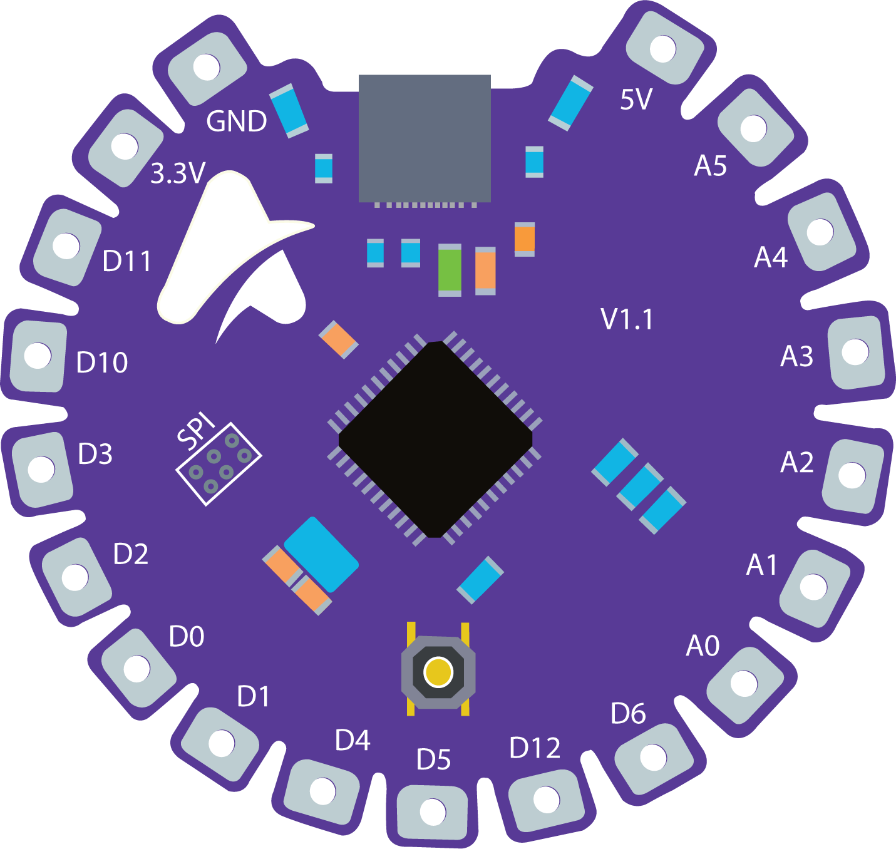

# A-Prototyping Hub

## Projects
### Pix3lone

This project is based for individuals who are interested to learn Microcontroller Programming. Hardware is design and built proudly in Maldives. 
When you plugin this board to your PC, it will be displayed as Arduino Leonardo.

For working examples please goto [Examples](https://github.com/aprototypingelectronix/aprototypingelectronix.github.io/tree/main/Examples "EXAMPLES") and if you have any comments or issues please goto [Issues](https://github.com/aprototypingelectronix/aprototypingelectronix.github.io/issues "ISSUES") and raise your voice!

The hardware includes:

* An SPI interface: for hardcore developers if they need to download custom bootloaders
* USB-C Interface: for programming uses (No need of external USART converters, You can plug-in to the PC and through Arduino IDE/Avrdude you can just upload the your firmware’s )
* Two LED’s: One LED will indicate the power to the board. Second one is connected to PE6 of ATMEGA32U4 (In Arduino Pin Mapping its pin 7)
* 500mA Fuse: Protection against over current on USB powerlines.

> Hardware Details and PIN Assignments

| ATMEGA32U4 PIN  | Board Markings | Arduino PIN Mapping  | Function Details |
| --------------- |:--------------:|:--------------------:|:----------------:|
| PD0             | D3             | 3                    | IO / SCL         |  
| PD1             | D2             | 2                    | IO / SDA         |         
| PD2             | D0             | 0                    | IO / Serial-RX   |
| PD3             | D1             | 1                    | IO / Serial-TX   |
| PD4             | D4             | 4                    | IO / ADC         |
| PD6             | D12            | 12                   | IO / ADC         |
| PD7             | D6             | 6                    | IO / ADC / PWM   |
| PC6             | D5             | 5                    | IO / PWM         |
| PF0             | A5             | A5                   | IO / ADC         |
| PF1             | A4             | A4                   | IO / ADC         |
| PF4             | A3             | A3                   | IO / ADC         |
| PF5             | A2             | A2                   | IO / ADC         |
| PF6             | A1             | A1                   | IO / ADC         |
| PF7             | A0             | A0                   | IO / ADC         |
| PE6             | -              | 7                    | Onboard LED      |

